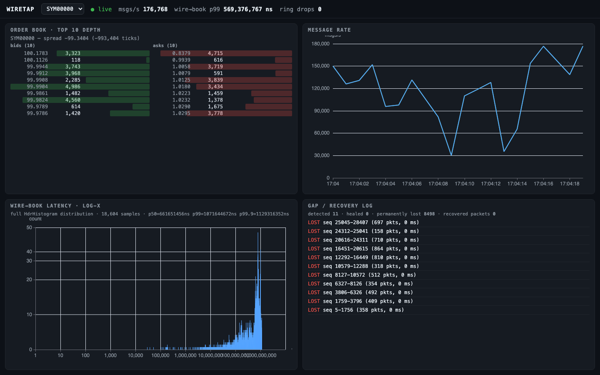

# WireTap

A low-latency UDP multicast market-data feed handler: lock-free receive and
decode in C++17, a Parquet data lake with a DuckDB query layer, and a live
React dashboard — all reproducible from committed scripts.



WireTap ingests a MoldUDP64-framed NASDAQ ITCH-5.0 subset at >1M msgs/s,
maintains a per-symbol limit order book, heals sequence gaps over TCP,
measures end-to-end latency in four stages with full-distribution
HdrHistograms, archives every update to partitioned Parquet, and streams the
book + latency tails to a browser at 10 Hz.

## Headline numbers

Measured by `./bench/run_bench.sh` + `bench/analyze.py` (medians of 5 repeats,
95% bootstrap CIs; full table in [bench/REPORT.md](bench/REPORT.md) and
[plots](bench/plots.html)). Environment: Linux 6.10 VM (Docker Desktop,
8 vCPUs, shared cores), busy-poll, batch 32, pinned, 500k msgs/s.

| | throughput | wire→book p50 | wire→book p99 | wire→book p99.9 |
|---|---|---|---|---|
| untuned (defaults) | 0.35M msgs/s | 266 us | 87.8 ms | 107.5 ms |
| tuned (pinned, batch 32) | 0.36M msgs/s | 271 us | 85.3 ms | 91.7 ms |

Hardware context, per-knob deltas, and what could not be measured here are in
[docs/TUNING.md](docs/TUNING.md) — nothing in this repo's docs is an invented
number.

## Quickstart

```sh
# local build + tests
cmake -S . -B build -DCMAKE_BUILD_TYPE=Release && cmake --build build -j
ctest --test-dir build --output-on-failure

# one-command demo stack (feedgen -> handler -> retransmit server -> dashboard)
./scripts/demo.sh                     # 5-minute feed at 100k msgs/s
WIRETAP_DURATION=30 ./scripts/demo.sh # quick 30-second run
```

Then open http://localhost:8088. The demo feed drops ~10% of packets on
purpose so the dashboard's gap/recovery panel has something to show.

Feed + receive on the loopback:

```sh
python3 tools/feedgen.py --mode udp --iface lo --rate 200000 --duration 30
./build/wiretap_recv --iface lo --mode busy --recover 127.0.0.1:38899 \
  --archive-dir ./archive --dash-socket /tmp/wiretap-dash.sock
```

Query the archive:

```sh
python3 tools/analytics.py --archive ./archive rate --bucket 1
python3 tools/analytics.py --archive ./archive top-symbols --n 10
python3 tools/analytics.py --archive ./archive depth --symbol SYM00000
python3 tools/analytics.py --archive ./archive latency
python3 tools/analytics.py --archive ./archive gaps
```

## Docs

- [docs/ARCHITECTURE.md](docs/ARCHITECTURE.md) — thread/data-flow diagram,
  packet lifetime, and the rationale for every hot-path decision
- [docs/TUNING.md](docs/TUNING.md) — Linux tuning knobs with measured deltas
  (and explicit statements of what could not be measured)
- [docs/wire-format.md](docs/wire-format.md) — the MoldUDP64/ITCH wire format
- [docs/perf-stat.txt](docs/perf-stat.txt),
  [docs/flamegraph-wiretap.svg](docs/flamegraph-wiretap.svg) — profile of a
  representative run
- [CONTRIBUTING.md](CONTRIBUTING.md) — build/test/lint/bench conventions

## What's real vs synthetic

**Real**: the receive path (busy-poll/epoll `recvmmsg`, kernel timestamping,
SPSC ring, bounds-checked decode, gap tracking + reorder window, TCP gap
recovery, per-symbol limit order book), the archive writer (Parquet, ZSTD,
hive-partitioned), the DuckDB query layer, the 10 Hz dashboard, the benchmark
harness, the profile/flamegraph, and every measurement in the docs — all
reproduced by committed scripts.

**Synthetic**: the feed. `tools/feedgen.py` generates a deterministic,
seeded, ITCH-format stream with a synthetic order lifecycle — realistic
wiring, fictional market data. There is no exchange connection, no session
protocol (login/sequence negotiation), and the retransmission server is a
tool, not an exchange service.

Measurements were produced on the hardware stated in
[docs/TUNING.md](docs/TUNING.md); running the same scripts elsewhere will
give different absolute numbers (the deltas are the point).
