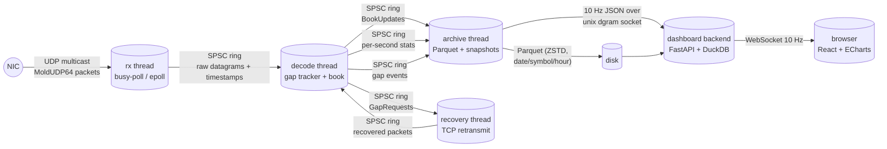

# WireTap architecture

## Thread and data-flow model

Three hot threads, three lock-free SPSC rings, zero mutexes anywhere on the data
path. Every arrow above is `try_push`-based: **if a consumer falls behind, the
producer drops the sample and counts it — it never blocks.**

| Thread | Pinned | What it does | What it never does |
|---|---|---|---|
| rx | `--rx-core` | recvmmsg/recvmsg, kernel timestamp extraction, `wire_to_userspace` recording, push to ring | decode, allocate, log, lock |
| decode | `--decode-core` | bounds-checked decode, gap tracking + reorder window, book apply, latency recording, per-second stats, pushes to downstream rings | block on IO, allocate beyond the gap path |
| archive | — | Parquet writer (ZSTD, ~1M-row groups), depth/stats/gaps tables, 10 Hz dashboard snapshots | touch hot-path state (it owns a second BookBuilder fed by the same stream) |
| recovery | — | TCP fetches of missing sequence ranges from the retransmission server | run on the hot path at all |

## Life of a packet: wire to book to browser

1. **Wire → kernel**: the NIC (or the loopback driver) timestamps the frame;
   `SO_TIMESTAMPING` (hw + sw) is enabled, falling back to `SO_TIMESTAMPNS`,
   then to the userspace clock. The mechanism is logged at startup and the
   per-datagram hw/sw counters at shutdown make clear which tier actually
   delivered stamps.
2. **Kernel → rx thread**: one `recvmmsg` call returns up to `--batch`
   datagrams into preallocated buffers. Per datagram the kernel timestamp is
   normalized into TSC ticks; `recv_ts` is `rdtsc()`.
   `wire_to_userspace = recv_ts - kernel_ts` is recorded into the rx thread's
   private HdrHistogram. The datagram (bytes + two tick timestamps) is copied
   into the SPSC ring.
3. **rx → decode thread**: the decode thread pops the ring. Per packet it
   records `queue_delay = decode_start - recv_ts` (ring dwell), runs the
   bounds-checked decode, applies the updates to the limit order book, and
   records `decode_time` and `wire_to_book = book_applied - kernel_ts`.
4. **Sequence discipline**: the packet's sequence number goes through the
   gap tracker. In order → applied immediately. A jump opens a GapEvent, the
   packet is buffered in the reorder window (default 1024), a GapRequest goes
   to the recovery thread, and the TCP retransmission server supplies the
   missing range. The window drains in sequence order once healed; after
   `--recover-timeout-ms` the remainder is declared permanently lost and
   processing continues.
5. **Decode → archive thread**: BookUpdates, per-second stats (including the
   full wire_to_book bucket distribution), and closed gap events flow through
   three SPSC rings. The archive thread writes Parquet (hive-partitioned
   `date/symbol/hour`, ZSTD), maintains a private copy of the book for live
   snapshots, and publishes a 10 Hz JSON snapshot over a unix datagram socket.
6. **To the browser**: the dashboard backend receives the datagrams, merges
   the per-second histogram dumps into a cumulative distribution, and fans
   state out over WebSocket. Historical queries go through DuckDB over the
   Parquet archive — always pre-aggregated server-side; raw rows are never
   shipped.

## Why the hot path looks the way it does

**SPSC, not MPMC.** There is exactly one producer and one consumer per ring —
that is a real invariant here (rx → decode → archive). A single-producer/
single-consumer queue needs no CAS loop, no lock, no blocking: head and tail
live on separate cache lines, each side caches the other's index, and the
common path touches exactly one shared line. An MPMC queue would pay for
generality the workload never uses.

**acquire/release, not seq_cst.** The only ordering needed is the classic
message-passing pair: the producer releases the slot contents along with the
head store; the consumer acquires the head load before reading the slot. Full
sequential consistency would fence every operation on both sides for no
additional guarantee. (Verified clean under TSan — the stress test pushes
10M items and asserts FIFO order and zero loss.)

**rdtsc, not clock_gettime.** A `clock_gettime` call is a vDSO trip costing
tens of nanoseconds per sample; `rdtsc` is ~20 cycles. The TSC is calibrated
once at startup against CLOCK_MONOTONIC, anchored to CLOCK_REALTIME, and
converted to nanoseconds only when a sample is *recorded*. The `constant_tsc`
CPU flag is checked and a loud warning printed if it is missing, because
per-core TSC offsets would skew everything. On non-x86 the time base falls
back to CLOCK_MONOTONIC transparently.

**The archive can drop, the hot path cannot.** Every downstream push is a
`try_push`: a full ring means the consumer (disk, dashboard) is behind, so the
sample is dropped and counted (`archive_drops`) and the feed keeps flowing.
The alternative — blocking or resizing — would couple disk latency to market
data latency, which is exactly backwards.

**No alloc, no lock, no log on rx/decode.** Batch buffers, cmsg space, ring
slots, and the update vector are all allocated at startup; the gap path is the
only place the decode thread allocates, and it allocates only when a gap
actually opens. Latency recording is per-thread into private HdrHistograms
(3 significant digits, 1 ns..10 s), merged only after the threads join.

**Bounds-checked, exception-free decode.** `decode_packet` returns an error
enum for malformed input and never reads past the buffer (unit tests include
every truncation point, a canary, a guard page, and an ASan build). It is
`noexcept`: on OOM the process terminates rather than unwinding a market-data
handler.

**Honest timestamps.** The shutdown report prints `hw=/sw=/userspace=` counts.
If the NIC never produced a hardware stamp, the number says so — a software
stamp is never presented as a hardware one, and if no kernel stamp exists at
all, `wire_to_userspace` simply has no samples for that run.
